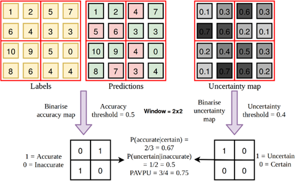

# PAvPU  (Patch Accuracy vs. Patch Uncertainty) Implementation
This repository contains the implementation of the Patch Accuracy vs. Patch Uncertainty (PAvPU) metric from the paper: https://arxiv.org/pdf/1811.12709.pdf.
PAvPU evaluates the for Bayesian models in semantic segmentation by comparing the accuracy of the model's predictions to the uncertainty of the predictions.
The metric is implemented in NumPy with a foucs on optimizing w.r.t. speed.

# Novel Extensions
- Padding (not in the original paper)
- Alternative metrics such as F1, Recall (not in the original paper) to replace Accuracy.
- Weighting scheme to account for class imbalance (not in the original paper).

# Installation
1) Clone this repository.
2) Set working directory to where the repository has been copied to (pavpu/)
3) Install
```
cd pavpu
python setup.py install
```
Soon to be released on PyPI.
# Testing
Testing was done on 
- the example illustration from the paper and 
- on a custom example which represents 2 Monte Carlo samples with 3 classes and 4x4 pixels (2, 3, 4, 4).

# Examples
## Example 1 (from the paper)
Graphical illustration of calculating the PAvPU metric on the example from the paper.



```
labels = np.array([[1,2,5,7],
                    [6,4,3,3],
                    [10,9,5,0],
                    [8,6,4,4]])
predictions = np.array([[1,2,4,7],
                        [5,6,3,3],
                        [10,9,4,0],
                        [8,7,3,4]])
uncertainty_map = np.array([[0.1, 0.3, 0.6, 0.3],
                            [0.7, 0.6, 0.2, 0.1],
                            [0.2, 0.4, 0.5, 0.3],
                            [0.1,0.7, 0.6, 0.2]])

# pavpu() expects one-hot encoded labels and predictions

def _get_one_hot(targets, nb_classes: int = None):
    if nb_classes is None:
        nb_classes = len(np.unique(targets))
    res = np.eye(nb_classes)[np.array(targets).reshape(-1)]
    return res.reshape(list(targets.shape)+[nb_classes])

labels_one_hot = np.transpose(np.expand_dims(_get_one_hot(self.labels),
                                             axis = 0),
                              axes=(0,3,1,2))
predictions_one_hot = np.transpose(np.expand_dims(_get_one_hot(self.predictions),
                                                  axis = 0),
                                   axes=(0,3,1,2))

pavpuscore, a_given_c, u_given_i = pavpu(prediction = predictions,
                                        target = labels,
                                        manual_unc_map = uncertainty_map,
                                        uncertainty_threshold = 0.4,
                                        base_metric_threshold = 0.5,
                                        base_metric = "accuracy")
```
## Example 2 (custom shape (2, 3, 4, 4))
```
mc_predictions = np.array([
            [
                # Monte Carlo sample 1
                [
                    # Class 1
                    [0.2, 0.5, 0.8, 0.0],
                    [0.1, 0.7, 0.1, 0.1],
                    [0.0, 0.6, 0.2, 0.2],
                    [0.0, 0.0, 0.07, 0.0]
                    ],
                # Class 2
                [
                    [0.3, 0.4, 0.2, 0.1],
                    [0.2, 0.1, 0.1, 0.2],
                    [0.1, 0.3, 0.3, 0.3],
                    [0.01, 0.05, 0.93, 0.02]
                ],
                # Class 3
                [
                    [0.5, 0.1, 0.0, 0.9],
                    [0.7, 0.2, 0.8, 0.7],
                    [0.9, 0.1, 0.5, 0.5],
                    [0.99, 0.95, 0.0, 0.98]
                ]
            ],
            [
                # Monte Carlo sample 2
                [
                    # Class 1
                    [0.3, 0.4, 0.2, 0.1],
                    [0.2, 0.1, 0.1, 0.2],
                    [0.1, 0.3, 0.3, 0.3],
                    [0.15, 0.15, 0.4, 0.3]
                ],
                    # Class 2
                [
                    [0.2, 0.5, 0.8, 0.0],
                    [0.1, 0.7, 0.1, 0.1],
                    [0.0, 0.6, 0.2, 0.2],
                    [0.15, 0.35, 0.3, 0.2]
                ],
                    # Class 3
                [
                    [0.5, 0.1, 0.0, 0.9],
                    [0.7, 0.2, 0.8, 0.7],
                    [0.9, 0.1, 0.5, 0.5],
                    [0.7, 0.5, 0.3, 0.5]
                ]
            ]
        ], dtype = np.float64)

preds_hard_labels = np.argmax(np.mean(self.sampled_outputs_custom_shape,
                                      axis = 0,
                                      keepdims = True),
                              axis = 0,
                              keepdims = True)

target =  = np.array([
            [# Class 1
                [1,1,0,1],
                [1,0,0,1],
                [1,1,0,1],
                [0,0,0,1]
            ],
            [# Class 2
                [0,0,1,0],
                [0,1,1,0],
                [0,0,0,0],
                [1,1,0,0]
             ],
            [# Class 3
                [0,0,0,0],
                [0,0,0,0],
                [0,0,1,0],
                [0,0,1,0]
             ]
            ])

pavpuscore, a_given_c, u_given_i = pavpu(prediction = preds_hard_labels,
                                         target = target,
                                         uncertainty_threshold = 0.3,
                                         base_metric_threshold = 0.1,
                                         base_metric = "accuracy")
```
# Dependencies
- Python >=3.9
- NumPy >= 1.24.2
- scikit-image >= 0.20.0
- scikit-learn >= 1.2.2

Most notably, skimage.util.view_as_windows is a very helpful function used to reshape images to blocks (patches).